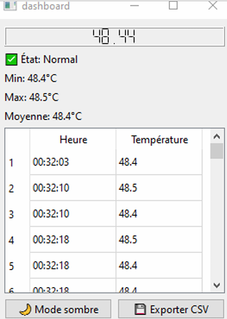
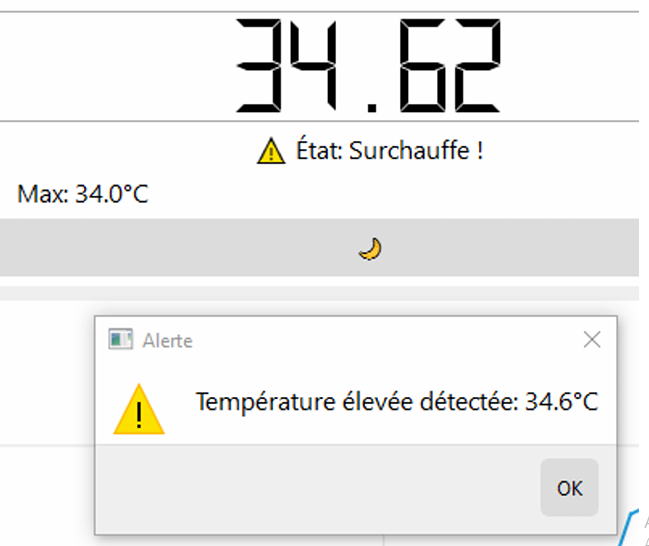

# AutoTemp

## Description  
AutoTemp is a temperature monitoring system for automobiles. It allows real-time measurement of engine or cabin temperature and sends alerts if the temperature exceeds critical thresholds, ensuring vehicle safety and performance.

## Key Features  
- Continuous measurement of engine or cabin temperature.  
- Audible and/or visual alerts in case of overheating.  
- Simple interface to view real-time temperature.  
- History of temperature readings for analysis.  
- Easy to integrate into various types of vehicles.

## Screenshots

  
*Interface showing real-time temperature and alerts.*

  
*Photo of the system installed in a vehicle.*

## Benefits  
- Effective prevention of overheating-related failures.  
- Quick alerts for immediate reaction.  
- Improved vehicle safety and longevity.  
- Compact and easy-to-install system.

## Contact  
Khouloud Othmani  
📧 Email: othmanikhouloud0@gmail.com  
🔗 LinkedIn: https://www.linkedin.com/in/khouloud-othmani-1566412b2
